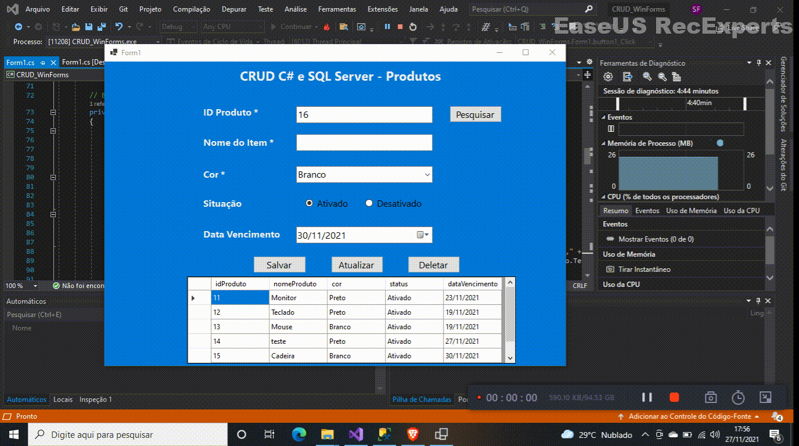

# CRUD_WindowsForm_CSharp
 CRUD Windows Form com C#
 
 Aplicação desenvolvida com Windows Form com C#, um CRUD simples realizando operações no Banco de dados SQL Server: Create, Read, Update e Delete. Nesta aplicação utilizo Stored Procedures para realizar tarefas no Banco.
 
 ## Create - Inserindo Produtos:
 
 
 
 ## Read - Listando produto por ID
 
 
 
 ## Update - Atualizando produtos
 
  
  
 ## Delete - Deletando um produto
 
  
  
  Note que em cada operação adicionei uma validação nos campos obrigatórios. 
  No GridView foi adicionado uma Procedure onde lista todos os produtos desta tabela.
  
  Obs: Devido ser Gifs mostrando cada ação da aplicação, a resolução não ficou das melhores.
  
  
 
 
 
